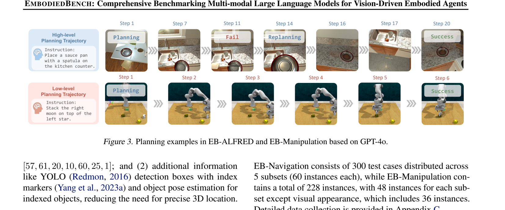
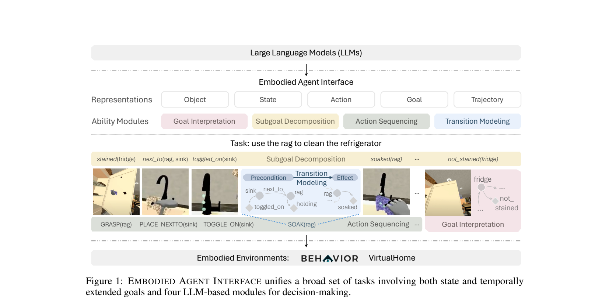
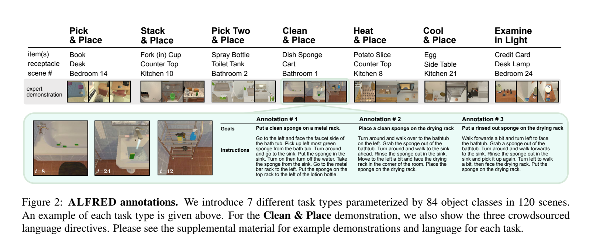
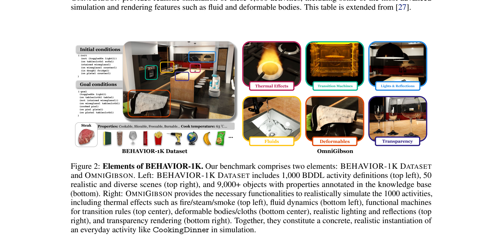
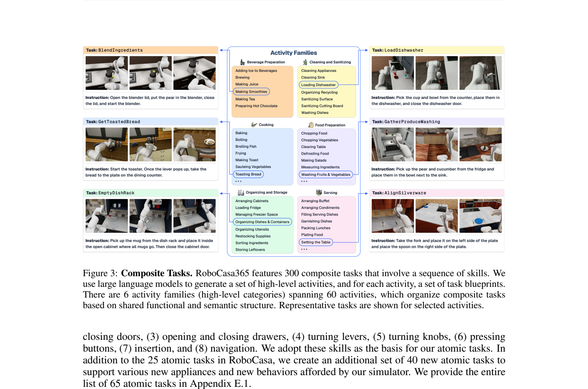
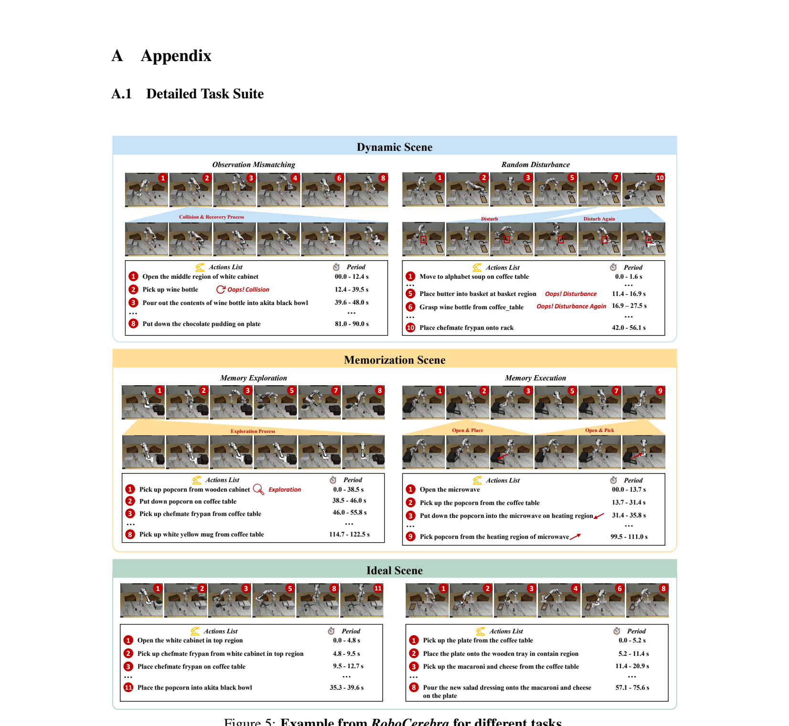

# 具身 Agent Benchmarks 整理

> 整理来源：用户提供的 6 篇本地 PDF。图片为从对应论文中截取的任务示例图。

## 1. EmbodiedBench

**论文**：*EmbodiedBench: Comprehensive Benchmarking Multi-modal LLMs for Vision-Driven Embodied Agents*

### 1.1 简介

EmbodiedBench 是一个面向多模态大模型具身决策能力的综合评测套件。它覆盖 4 个环境、1,128 个测试任务，既包含高层 household / rearrangement 任务，也包含低层 navigation / manipulation 任务。它的核心特点是把任务按能力拆成 6 类子集：Base、Common Sense、Complex Instruction、Spatial Awareness、Visual Appearance、Long Horizon，用来细粒度分析 MLLM 在视觉、空间、常识、复杂指令和长程规划上的能力。

4 个子环境：

| 子环境 | 来源/类型 | 动作层级 | 任务数 |
|---|---|---:|---:|
| EB-ALFRED | AI2-THOR + ALFRED household tasks | high-level | 300 |
| EB-Habitat | Habitat Language Rearrangement | high-level | 300 |
| EB-Navigation | AI2-THOR navigation | low-level navigation | 300 |
| EB-Manipulation | VLMBench / CoppeliaSim | low-level robot arm manipulation | 228 |

### 1.2 任务示例图

### 1.3 完整任务 Example

| 类型                                    | 任务例子                                    |
| ------------------------------------- | --------------------------------------- |
| EB-ALFRED long-horizon                | 拿起刀，切苹果，把刀放进碗里，把苹果片放进微波炉加热，再把苹果片放到桌上。   |
| EB-Habitat multi-object rearrangement | 将魔方、扳手和碗分别搬到指定的 counter/table 位置。       |
| EB-Manipulation low-level             | 抓起星形积木并放入银色容器；或把右侧 moon 形物体叠到左侧 star 上。 |
| EB-Navigation visual target           | 根据自然语言提示找到 pillow / toaster 等目标，并尽量靠近它。 |

### 1.4 怎么评估

主指标是 **Task Success Rate (SR)**：任务完成则为 1，否则为 0。高层任务还可以用 PDDL / symbolic goal 判断子目标完成；低层导航和操作任务依赖环境状态、距离或动作执行结果判断。论文还报告了子目标成功率、planner steps 和 environment steps，并做了视觉输入、检测框、多视角、多步图像、visual ICL 等消融。

### 1.5 任务长度

- 高层任务最大环境步数约 30；EB-Navigation 最大 20；EB-Manipulation 最大 15。
- EB-ALFRED long-horizon 子集通常需要超过 15 步。
- 平均执行步数示例：GPT-4o 在 EB-ALFRED / EB-Habitat / EB-Navigation / EB-Manipulation 上的平均环境步数分别为 16.3 / 13.1 / 15.5 / 12.9。

### 1.6 Baselines 和成绩

单位：Task Success Rate (%)。

| Model | EB-ALFRED | EB-Habitat | EB-Navigation | EB-Manipulation |
|---|---:|---:|---:|---:|
| GPT-4o | 56.3 | 59.0 | 57.7 | 28.9 |
| GPT-4o-mini | 24.0 | 32.7 | 32.8 | 4.8 |
| Claude-3.7-Sonnet | 67.7 | 58.7 | 45.0 | 28.5 |
| Claude-3.5-Sonnet | 64.0 | 68.0 | 44.7 | 25.4 |
| Gemini-1.5-Pro | 62.3 | 56.3 | 24.3 | 21.1 |
| Qwen-VL-Max | 41.3 | 45.3 | 39.7 | 18.0 |
| InternVL3-78B | 39.0 | 55.0 | 53.7 | 26.3 |
| Ovis2-34B | 28.7 | 37.0 | 45.7 | 26.8 |

论文结论：MLLM 在高层规划明显强于低层操作；低层 manipulation 最难，最佳模型也只有约 28.9%。

## 2. Embodied Agent Interface (EAI)

**论文**：*Embodied Agent Interface: Benchmarking LLMs for Embodied Decision Making*

### 2.1 简介

Embodied Agent Interface 不是传统“端到端机器人策略”benchmark，而是把具身决策拆成标准化接口，专门评估 LLM 在 symbolic embodied decision making 中的能力。它统一了状态、对象、动作、目标、轨迹表示，并把 LLM 模块分成 4 类：Goal Interpretation、Subgoal Decomposition、Action Sequencing、Transition Modeling。评测落在 VirtualHome 和 BEHAVIOR 两个模拟器上，重点是 long-horizon household decision making。

数据规模：

| Simulator | task name | task instruction | trajectory | steps | avg. step |
|---|---:|---:|---:|---:|---:|
| VirtualHome | 26 | 338 | 338 | 2,960 | 8.76 |
| BEHAVIOR | 100 | 100 | 100 | 1,460 | 14.6 |

### 2.2 任务示例图

### 2.3 完整任务 Example

| 类型 | 任务例子 |
|---|---|
| Goal Interpretation | 输入自然语言“用抹布清洁冰箱”，模型需要输出目标状态，例如冰箱从 stained 变成 not_stained。 |
| Action Sequencing | 对同一任务生成可执行轨迹：抓取抹布、移动到水槽、打开水、浸湿抹布、移动到冰箱、清洁冰箱。 |
| Subgoal Decomposition | 先让抹布靠近水槽并变湿，再让 agent 靠近冰箱，最后达成冰箱干净的目标状态。 |
| Transition Modeling | 为 SOAK / CLEAN / GRASP 等动作预测 precondition 和 effect，供 PDDL planner 使用。 |

### 2.4 怎么评估

| 模块 | 输入/输出 | 主要指标 |
|---|---|---|
| Goal Interpretation | 初始状态 + 自然语言目标 -> LTL goal | F1 |
| Action Sequencing | 初始状态 + goal + transition model -> action trajectory | Task SR, Execution SR, runtime error 类型 |
| Subgoal Decomposition | 初始状态 + goal -> subgoal trajectory | Task SR, Execution SR |
| Transition Modeling | 初始状态 + goal + operator -> precondition/effect | F1, Planner SR |

它的强项是错误分析很细：grammar / parsing error、hallucination、missing step、additional step、wrong order、affordance error、goal satisfaction error 等都能定位。

### 2.5 任务长度

- VirtualHome 平均 8.76 个 action steps。
- BEHAVIOR 平均 14.6 个 action steps。
- BEHAVIOR 任务平均有 6.7 个 grounded goals，平均 4,164.4 个 goal options，所以更偏长程和组合式推理。

### 2.6 Baselines 和成绩

单位：Average Perf. (%)，V = VirtualHome，B = BEHAVIOR。

| Model | Avg Perf. V | Avg Perf. B | 备注 |
|---|---:|---:|---|
| o1-preview | 64.4 | 74.9 | 总体最强，BEHAVIOR 上优势明显 |
| Claude-3.5 Sonnet | 65.7 | 64.2 | Goal interpretation / transition modeling 强 |
| GPT-4o | 63.3 | 59.8 | 综合强，但 BEHAVIOR action sequencing 仍较难 |
| Gemini 1.5 Pro | 65.7 | 48.8 | Goal interpretation 较强 |
| Mistral Large | 55.8 | 50.4 | VirtualHome action sequencing 表现好 |
| Llama 3 70B Instruct | 47.3 | 48.1 | 开源模型里较强 |
| Llama 3 8B Instruct | 28.4 | 23.1 | 明显落后 |

Action Sequencing 的 BEHAVIOR Task SR 代表值：o1-preview 81.0%，Claude-3.5 Sonnet 60.0%，o1-mini 56.0%，GPT-4o 47.0%。

## 3. ALFRED

**论文**：*ALFRED: A Benchmark for Interpreting Grounded Instructions for Everyday Tasks*

### 3.1 简介

ALFRED 是经典的 embodied instruction following benchmark，全称 Action Learning From Realistic Environments and Directives。它要求 agent 根据自然语言高层目标和逐步指令，在 AI2-THOR 中执行导航、物体交互和状态改变。核心难点是部分可观测、长程动作序列、不可逆状态变化、语言 grounding，以及像素级 interaction mask。

数据规模：

- 25,743 条英文 directives。
- 8,055 条 expert demonstrations。
- 平均每条 demonstration 50 action steps。
- 120 个室内场景，7 类任务，84 个对象类。

### 3.2 任务示例图

### 3.3 完整任务 Example

| 任务类型 | 任务例子 |
|---|---|
| Clean & Place | 从浴缸附近拿起脏海绵，走到水槽清洗，再把干净海绵放到金属晾架上。 |
| Heat & Place | 拿刀切土豆，放下刀，拿起土豆片，将土豆片放进微波炉加热，再放到 counter 上。 |
| Cool & Place | 切生菜，拿起一片生菜，放进冰箱冷却，再取出放到 counter 上。 |
| Examine in Light | 拿起床上的书，走到床头柜，打开台灯，在灯光下检查书。 |

7 类任务：Pick & Place、Stack & Place、Pick Two & Place、Clean & Place、Heat & Place、Cool & Place、Examine in Light。

### 3.4 怎么评估

| 指标 | 含义 |
|---|---|
| Task Success | 终止时对象位置和状态完全满足任务目标，则成功 |
| Goal-Condition Success | 按目标条件拆分，计算完成比例 |
| Path Weighted Metrics | 用 expert path length 对 Task / Goal-Condition Success 加权，惩罚过长路径 |
| Sub-goal Evaluation | 先 replay expert 到某个 subgoal 前，再让 agent 完成该 subgoal |

ALFRED episode 超过 1000 步或失败动作超过 10 次会终止。

### 3.5 任务长度

- Expert demonstration 平均 50 action steps。
- 每个任务平均 2.55 个 goal conditions。
- 每个任务平均约 7.5 个 sub-goals。
- 动作空间：5 个导航动作 + 7 个交互动作 + Stop；交互动作需要像素级 mask。

### 3.6 Baselines 和成绩

单位：Task Success / Goal-Condition Success (%)，这里列 Test Seen / Test Unseen。

| Model | Test Seen Task | Test Seen Goal | Test Unseen Task | Test Unseen Goal |
|---|---:|---:|---:|---:|
| No Language | 0.2 | 5.0 | 0.2 | 6.6 |
| No Vision | 0.0 | 3.9 | 0.2 | 6.6 |
| Goal-only | 0.1 | 5.0 | 0.2 | 6.9 |
| Instructions-only | 2.7 | 8.2 | 0.5 | 7.2 |
| Seq2Seq | 2.1 | 7.4 | 0.5 | 7.1 |
| Seq2Seq + PM Progress-only | 3.0 | 8.0 | 0.3 | 7.3 |
| Seq2Seq + PM Subgoal-only | 3.8 | 8.9 | 0.5 | 7.1 |
| Seq2Seq + PM Both | 4.0 | 9.4 | 0.4 | 7.0 |
| Human | - | - | 91.0 | 94.5 |

论文结论：早期 Seq2Seq baseline 几乎无法完成完整任务，但在部分 sub-goal 上有可观成功率，例如 Seen 环境中 Goto / Pickup 可到约 51% / 32%。

## 4. BEHAVIOR-1K

**论文**：*BEHAVIOR-1K: A Human-Centered Embodied AI Benchmark with 1000 Everyday Activities and Realistic Simulation*

### 4.1 简介

BEHAVIOR-1K 是面向 human-centered robotics 的大规模日常活动 benchmark。它不是研究者拍脑袋列任务，而是先做“人们希望机器人帮自己做什么”的调查，再选出 1,000 个高需求活动。benchmark 包含两部分：BEHAVIOR-1K Dataset 和 OMNIGIBSON simulator。前者定义 1,000 个 BDDL 活动、50 个场景、9,000+ 对象；后者支持刚体、柔体、液体、布料、温度、污渍、浸湿等更真实的物理和状态变化。

### 4.2 任务示例图

### 4.3 完整任务 Example

| 任务 | 任务内容 |
|---|---|
| CookingDinner | 初始状态包含未开灯、脏酒杯、面团在冰箱等；目标是开灯、铺桌布、洗净酒杯、烤好派并摆盘。 |
| CollectTrash | 收集空瓶和杯子，把它们丢进垃圾桶，涉及移动、拾取、放置和记忆已清理位置。 |
| StoreDecoration | 将物品存入抽屉，涉及 articulated object manipulation。 |
| CleanTable | 用浸湿的布擦干净脏桌子，涉及柔性材料、液体/浸湿状态和擦拭动作。 |

### 4.4 怎么评估

| 指标 | 含义 |
|---|---|
| Task Success Rate | 是否满足 BDDL goal conditions |
| Distance Navigated | 机器人导航距离 |
| Simulated Time | 模拟耗时 |
| Kinematic Disarrangement | 机器人运动造成的物体位移 |
| Success Score Q | 来自 BEHAVIOR-100 的综合成功分数 |

论文还做了 sim-real gap 分析，比较 simulation、real-world optimal policy 和 real-world trained policy 的失败来源。

### 4.5 任务长度

- 1,000 个活动，来自 2,090 个候选活动的筛选。
- 每个活动涉及约 3-47 个对象、2-11 个 required state changes。
- 实验任务中，CleanTable 的最优 primitive 序列约 6 步，CollectTrash 至少 16 primitive steps。
- 附录说明 BEHAVIOR-1K 活动在底层环境中常需要 hundreds 到 thousands of environment steps。

### 4.6 Baselines 和成绩

单位：Task success rate。

| Method | Primitives | History | StoreDecoration | CollectTrash | CleanTable |
|---|---|---|---:|---:|---:|
| RL-VMC | 否 | 否 | 0.00 ± 0.00 | 0.00 ± 0.00 | 0.00 ± 0.00 |
| RL-Prim. | 是 | 否 | 0.48 ± 0.06 | 0.42 ± 0.02 | 0.77 ± 0.08 |
| RL-Prim.Hist. | 是 | 是 | 0.55 ± 0.05 | 0.63 ± 0.03 | 0.88 ± 0.02 |

CollectTrash 效率指标：

| Method | Distance Nav. (m) | Sim. Time (s) | Kin. Dis. (m) |
|---|---:|---:|---:|
| RL-VMC | 27.58 ± 5.95 | 16.67 ± 0.00 | 0.00 ± 0.00 |
| RL-Prim. | 17.98 ± 2.35 | 13.95 ± 5.14 | 12.34 ± 5.01 |
| RL-Prim.Hist. | 15.33 ± 2.70 | 12.48 ± 3.68 | 10.82 ± 3.90 |

论文结论：纯 visuomotor RL 完全失败，加入动作 primitive 后才有可观成功率；history 对长程任务尤其重要。

## 5. RoboCasa365

**论文**：*RoboCasa365: A Large-Scale Simulation Framework for Training and Benchmarking Generalist Robots*

### 5.1 简介

RoboCasa365 是面向 household mobile manipulation generalist robot 的大规模仿真训练与评测框架。它基于 RoboCasa 扩展，包含 365 个厨房日常任务、2,500 个厨房场景、3,200+ 对象、456 个可交互 fixture/appliance、600+ 小时人类演示和 1,600+ 小时 MimicGen synthetic demonstration。它的目标是系统研究多任务训练、机器人 foundation model 训练和 lifelong learning。

### 5.2 任务示例图

### 5.3 完整任务 Example

| 任务 | 子任务数 | 任务内容 |
|---|---:|---|
| BlendIngredients | 3-4 | 打开 blender lid，把梨放进 blender，关上盖子并启动 blender。 |
| LoadDishwasher | 3 | 从 counter 拿起杯子和碗，放入 dishwasher，再关闭 dishwasher door。 |
| GetToastedBread | 4 | 启动 toaster，等 lever 弹起后，把面包拿到 dining counter 的盘子上。 |
| PackIdenticalLunches | 15 | 将两份相同的物品分别放入 tupperware，打包两份相同午餐。 |
| SeparateFreezerRack | 7 | 把肉类容器放到 freezer 第二高架，把蔬菜容器放到最高架。 |

### 5.4 怎么评估

每个 evaluation task 运行 30 trials，在任务特定最大时长内达到 binary success condition 即算成功。论文报告跨任务平均 Task Success Rate，并分三类 target splits：

- Atomic：18 个代表性 atomic tasks。
- Composite-Seen：16 个 composite tasks，训练中见过对应活动。
- Composite-Unseen：16 个 composite tasks，活动在 pretraining 中未见。

评测设置包括：

- Multi-task training。
- Foundation model pretraining + target fine-tuning。
- Lifelong learning。
- Pretraining data composition。
- Real-world transfer。

### 5.5 任务长度

- 365 个任务 = 65 atomic + 300 composite。
- 220 个任务需要 mobile manipulation，145 个不需要移动底盘。
- target composite task 中有 2-subtask 到 15-subtask 不等。
- 55k human episodes 中多数在 10-60 秒，长尾任务超过 3 分钟。
- 仿真 20 Hz，使用 operational space controller。

### 5.6 Baselines 和成绩

Multi-task training，单位：Task Success Rate (%)。

| Task split | Diffusion Policy | π0 | π0.5 | GR00T N1.5 |
|---|---:|---:|---:|---:|
| Atomic | 15.7 | 36.3 | 39.6 | 43.0 |
| Composite-Seen | 0.2 | 5.2 | 7.1 | 9.6 |
| Composite-Unseen | 1.25 | 0.7 | 1.2 | 4.4 |
| Average | 6.1 | 15.0 | 16.9 | 20.0 |

Foundation model training，使用 GR00T N1.5，单位：Task Success Rate (%)。

| Setting | Atomic | Composite-Seen | Composite-Unseen | Average |
|---|---:|---:|---:|---:|
| Pretraining only | 41.9 | 0.0 | 0.2 | 15.1 |
| Target only, 10% data | 38.7 | 11.0 | 11.2 | 21.0 |
| Target only, 100% data | 60.6 | 35.0 | 33.3 | 43.7 |
| Pretraining + target, 10% data | 56.9 | 25.4 | 22.7 | 35.9 |
| Pretraining + target, 100% data | 68.5 | 40.6 | 42.1 | 51.1 |

Real-world transfer：

| Setting | Avg success |
|---|---:|
| Real only | 61.8 |
| Sim-and-real | 79.8 |

论文结论：GR00T N1.5 在多任务训练中最好，但 composite 任务仍明显困难；预训练能显著提高下游数据效率，sim-and-real 能提升真实机器人表现。

## 6. RoboCerebra

**论文**：*RoboCerebra: A Large-scale Benchmark for Long-horizon Robotic Manipulation Evaluation*

### 6.1 简介

RoboCerebra 面向长程机器人操作中的 System 2 reasoning：规划、反思、记忆。它不是只看低层动作控制，而是把 VLM 作为高层 planner，与 OpenVLA / π0-fast 这类低层 VLA controller 组成 hierarchical framework。任务由 GPT 生成高层目标并分解子步骤，人类在仿真中执行并标注时间段，benchmark 特别强调动态场景、部分可观测、记忆依赖和长程任务。

### 6.2 任务示例图

### 6.3 完整任务 Example

| 类型 | 任务例子 |
|---|---|
| Dynamic Scene / Observation Mismatching | 打开白色柜子中层，拿起酒瓶，倒入碗中；过程中出现碰撞，系统需要 recovery 并继续任务。 |
| Random Disturbance | 把 butter 放入 basket 后环境被扰动，之后还需要抓取 wine bottle 并完成后续放置。 |
| Memory Exploration | 从木柜中找 popcorn，把它放到 coffee table；agent 需要记住已探索的柜子区域。 |
| Memory Execution | 打开 microwave，把 popcorn 放进去，再从 heating region 取出；后续执行依赖之前的隐藏状态记忆。 |
| Ideal Scene | 静态可见场景下，打开柜子、拿锅、放到桌上，或把盘子放进 tray，再把食物倒到盘子上。 |

### 6.4 怎么评估

任务分为 6 类：Random Disturbance、Observation Mismatching、Memory Exploration、Memory Execution、Mix、Ideal。每个方法评估 600 rollouts，即 60 tasks × 10 trials。

指标：

| 指标                                 | 含义                                     |
| ---------------------------------- | -------------------------------------- |
| Task Success Rate (SR)             | 关键对象状态转换是否达成                           |
| Average Plan Match Accuracy (AccP) | 预测 high-level plan 与人类标注 plan 的一致性     |
| Plan Efficiency (η)                | SR / 平均 plan length                    |
| Action Completion Accuracy (AccC)  | VideoQA 判断动作/子任务完成的准确率，用于衡量 reflection |

### 6.5 任务长度

- 1,000 条 human-annotated trajectories，覆盖 100 个 task variants。
- 每个 task instance 有 2 到 20+ atomic steps，均值 9.1。
- 总计 10,000+ step-level segments。
- 平均 trajectory length 为 2,972.4 simulation steps，约为已有长程 manipulation benchmark 的 6 倍。

### 6.6 Baselines 和成绩

主结果，单位：Average success rate (%)。

| Method | Avg | Random Dist. | Obs. Mismatch | Mem. Exp. | Mem. Exe. | Mix | Ideal |
|---|---:|---:|---:|---:|---:|---:|---:|
| OpenVLA-Libero100 | 2.00 | 4.59 | 1.35 | 0.18 | 1.86 | 0.00 | 4.05 |
| OpenVLA* | 4.57 | 7.84 | 8.65 | 1.06 | 2.06 | 0.00 | 7.84 |
| Planner + OpenVLA* | 16.04 | 18.63 | 19.45 | 8.04 | 16.69 | 11.48 | 21.92 |
| Hierarchical Framework | 16.55 | 18.63 | 19.18 | 9.06 | 17.83 | 13.21 | 21.10 |

Planner ablation，单位：Average success rate (%)。

| Planner | Avg |
|---|---:|
| GT-plan | 25.16 |
| GPT-4o | 16.04 |
| GPT-4o-Blind | 15.10 |
| LLaVA-Next-Video | 11.37 |
| Qwen2.5-VL | 11.19 |
| LLaVA-Next-Blind | 8.00 |

System 2 细分指标：

| Model | AccP | AccC | SR | Len | η |
|---|---:|---:|---:|---:|---:|
| GPT-4o | 68.33 | 32.66 | 16.04 | 10.67 | 1.50 |
| GPT-4o-Blind | 61.37 | 0.00 | 15.10 | 10.73 | 1.41 |
| LLaVA-Next-Video-7B | 40.00 | 37.19 | 11.37 | 8.33 | 1.36 |
| Qwen2.5-VL-7B | 44.67 | 47.74 | 11.19 | 8.30 | 1.34 |
| Qwen2.5-VL-7B-SFT | 30.00 | 66.83 | 9.33 | 6.95 | 1.32 |

论文结论：单纯 OpenVLA 在长程任务中几乎失效；加入 System 2 planner 后成功率显著提升，但即便 GPT-4o + OpenVLA 也离 GT-plan 有明显差距。

## 横向观察

| Benchmark | 核心对象 | 最适合评估什么 |
|---|---|---|
| EmbodiedBench | MLLM as vision-driven embodied agent | 视觉输入下的高层/低层任务执行、能力子集分析 |
| Embodied Agent Interface | LLM modules for symbolic embodied decision making | goal/action/subgoal/transition 四类接口能力和错误类型 |
| ALFRED | Language + egocentric vision -> household action sequence | grounded instruction following、长程任务、交互 mask |
| BEHAVIOR-1K | Human-centered everyday activities in realistic simulation | 日常活动、多物理状态、长程移动操作、sim-real gap |
| RoboCasa365 | Generalist robot policies in kitchen simulation | 多任务训练、foundation model、lifelong learning、sim-to-real |
| RoboCerebra | VLM System 2 + VLA System 1 | 长程 manipulation 中的规划、反思、记忆、动态环境适应 |

